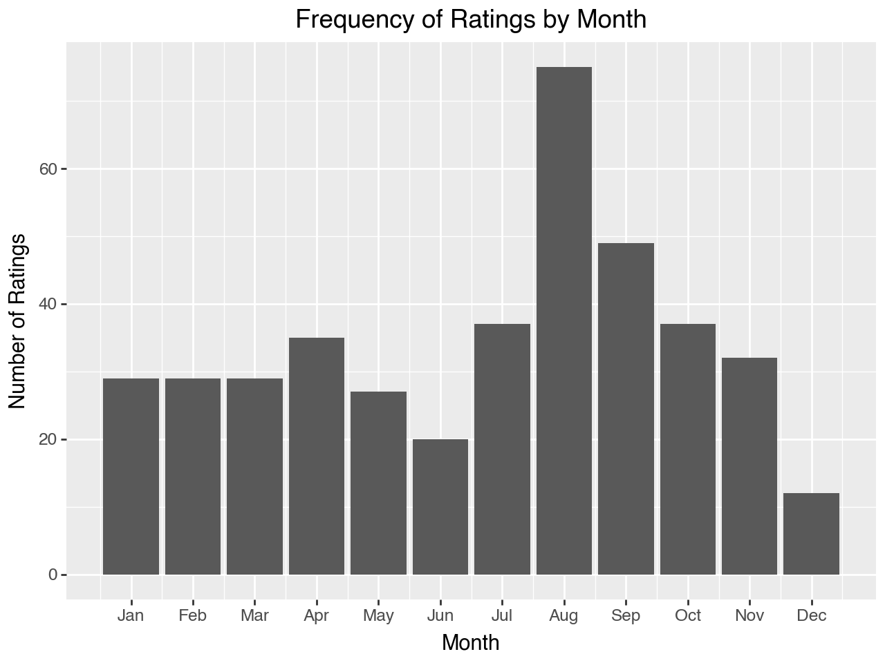

# IMDb Ratings & Actor Analysis

This project analyzes **personal IMDb movie ratings**, extracting insights into **favorite actors, controversial ratings, and rating trends over time**. The analysis leverages **Python (pandas, matplotlib, plotnine)** and is structured into a modular pipeline for **data cleaning, enrichment, and visualization**.

## **Overview**
- **Data Sources**: Personal IMDb ratings export.  
- **Enrichment**: Scrapes IMDb to add cast information.  
- **Analysis**: Evaluates actor collaborations, rating patterns, and rating deviations.  
- **Outputs**: Tables and visualizations in `.png` format.  

## **Core Components**
### **1️⃣ Cast Enrichment (`add_cast.py`)**
- Scrapes IMDb for the **top 10 cast members** of each movie/series.
- Merges cast data with **personal ratings**.
- Saves the updated dataset (`my_ratings_with_cast.csv`).

### **2️⃣ Data Cleaning (`clean_data.py`)**
- Filters **relevant rating attributes** (IMDb score, director, votes, genre).
- Converts dataset into **long-form format**, associating **each actor** with every film they appeared in.
- Saves the cleaned dataset (`actors_long.csv`).

### **3️⃣ Data Analysis (`analysis.py`)**
Performs **statistical analysis and visualization** based on personal IMDb ratings.

#### 🎭 **Actor Analysis**
- **`actor_summary.csv`** → Counts actor appearances, IMDb rating averages, and personal rating averages.
- **Top Favorite Actors:**  
  

#### 🎬 **Director-Actor Collaborations**
- **Most Frequent Collaborations:**  
  

#### 🎭 **Controversial Ratings**
- **Films with the biggest rating differences:**  
  

#### 📊 **Trends & Distributions**
- **Ratings by Month:**  
  

- **Movie Releases by Month:**  
  

- **Personal Rating vs. IMDb Rating:**  
  

- **IMDb Rating vs. Number of Votes:**  
  

## **Workflow**
1. **Run `add_cast.py`** → Fetches IMDb cast data.  
2. **Run `clean_data.py`** → Cleans and structures the dataset.  
3. **Run `analysis.py`** → Generates tables and visualizations.  
4. **All results are saved in `/data` and `/output` directories.**  

---

This project provides a **personalized IMDb analysis**, uncovering rating biases, favorite actors, and hidden trends in **movie-watching habits**. 🎥✨